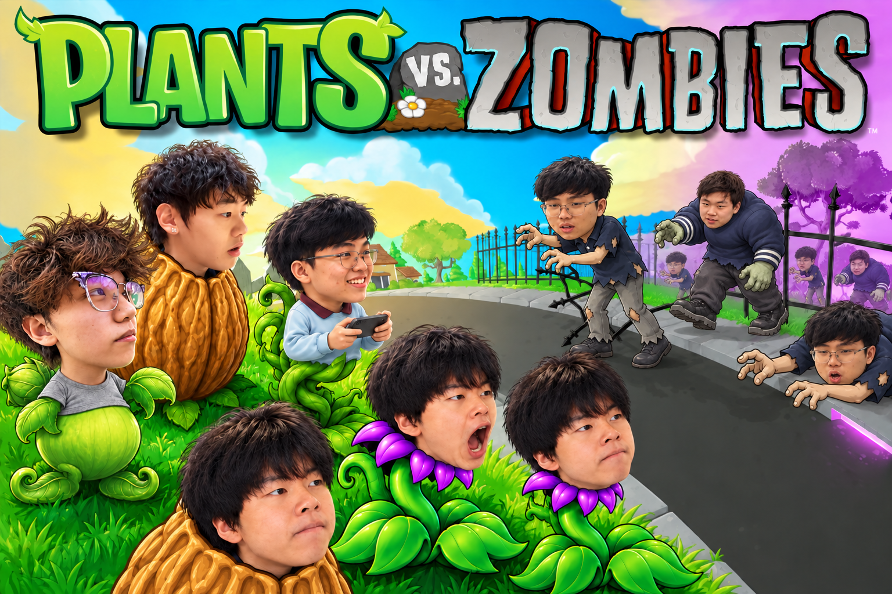

<h1 align="center">Wardlaw Hartridge PvZ</h1>

<p align="center">Familiar lawn defense. Familiar faces. A very different school day.<br/>A personal Plants vs. Zombies fan project inspired by the inside jokes of Wardlaw Hartridge's international students.</p>

<p align="center">
  <strong>English</strong> · <a href="README.zh-CN.md">简体中文</a> ·
  <a href="https://pvz.rosebeg.com/">Play in Browser</a> ·
  <a href="#quickstart">Quickstart</a> · <a href="#credits-and-usage">Credits</a>
</p>

<p align="center">
  
  
  
</p>

<p align="center">
  
  <br/><sub>Project cover artwork; the game uses its own animated character sprites.</sub>
</p>

## Overview

Wardlaw Hartridge PvZ turns school inside jokes into a playable lawn-defense campaign. Portrait-based plants, zombies, and a custom guide named **凯夫** bring familiar faces into the game, with their own animations, attacks, and sound effects.

Built on [wszqkzqk/pypvz](https://github.com/wszqkzqk/pypvz), this edition adds a custom five-stage campaign, an eleven-card roster, and a browser port that runs the Python game through Pygbag and CPython WebAssembly. The original 800 × 600 playfield scales to fit the screen while retaining the full board and card bank.

This is an **unofficial personal fan project**, unaffiliated with the school or the official Plants vs. Zombies game. The game interface and dialogue are primarily in Simplified Chinese. The repository is private and contains custom portrait assets.

## Play

Open **[pvz.rosebeg.com](https://pvz.rosebeg.com/)**, click **Start the game**, and wait for the runtime and assets to load. Choose **开始冒险吧** for the campaign or **玩玩小游戏** for mini-games.

- **Plant:** select a card, then click or tap an empty lawn tile. Collect sun to afford more plants.
- **Inspect:** hover over a card for half a second, or long-press it on a touch device, to read its description.
- **Manage:** use the shovel to remove a plant and the in-game speed button to toggle 2× speed.
- **On mobile:** landscape orientation gives the board more room. Switching away pauses the game and audio.

The first launch requires an internet connection to download the game assets and the runtime from Pygbag's CDN. A click or tap is needed to enable browser audio.

### Progress and saves

Progress is stored in the current browser. Use **操作 / 存档** to export a JSON backup or import one on another device. Refreshing does **not** preserve an unfinished battle; clearing browser data removes local progress. Browser saves are separate from the desktop version's save files.

## Features

| Feature | What is included |
| --- | --- |
| Portrait cast | Custom plants, regular and elite zombies, guide dialogue, animations, and sound effects |
| Eleven-card roster | Sun production, homing shots, blocking, chomping, explosions, melee attacks, healing, three-lane fire, and a returning boomerang |
| Campaign progression | Fixed decks, tutorial planting, and card rewards as the lawn expands from one lane to three and then five |
| Endless defense | Stage five keeps the board and sun between waves while enemy strength increases |
| Mini-games | The inherited mini-game menu remains available alongside the custom campaign |
| Game feedback | Card descriptions, health bars for supported characters, and 2× speed |
| Browser support | Mouse and touch input, proportional display scaling, local saves, and automatic pause/mute on focus loss |

The **回头浪子** boomerang travels up to five tiles forward in its lane, pierces enemies, and can hit each enemy once on the outward trip and once on the return. Its animation includes idle, wind-up, throw, wait, and catch states.

### Five-stage campaign

| Stage | In-game title | Lawn | Progression |
| --- | --- | --- | --- |
| 1 | 初见草坪 · First Steps | 1 lane | Start with two cards; unlock the blocker and chomper |
| 2 | 三路挑战 · Three-Lane Challenge | 3 lanes | Unlock the cherry bomb and potato mine |
| 3 | 初出茅庐 · Finding Your Feet | 5 lanes | Unlock the boxer, squash, healer, threepeater, and boomerang |
| 4 | 全员出击 · All Hands on Deck | 5 lanes | Use all eleven cards and clear the final finite stage |
| 5 | 无尽守卫 · Endless Defense | 5 lanes | Survive increasingly difficult waves and improve your best wave record |

### Optional keyboard shortcuts

These shortcuts are available for experimentation; ordinary progression does not require them.

| Key | Action |
| --- | --- |
| `9` | Add 100 sun |
| `0` | Reset plant-card cooldowns |
| `-` | Previous stage |
| `=` / `+` | Next stage |

## Quickstart

Use **Python 3.12**, [uv](https://docs.astral.sh/uv/), and Git. Access to this private repository is required to clone it.

```sh
git clone https://github.com/Ha22yX/Wardlaw-Hartridge-PvZ.git
cd Wardlaw-Hartridge-PvZ
uv sync
uv run python tools/build_web.py
uv run python -m http.server 8787 --bind 127.0.0.1 --directory dist
```

Open **[localhost:8787](http://127.0.0.1:8787/)**. Serve the files over HTTP rather than opening `index.html` directly. The build packages Python source and game resources into asset archives; the browser runtime still needs network access on first launch.

The generated `dist/` directory can be served by a static HTTPS host. The existing site uses Nginx; deployment paths and certificate maintenance are recorded in [hosting notes](docs/hosting.md).

## How It Works

The browser runs the existing Python/Pygame game through **Pygbag 0.9.3**, with **pygame-ce 2.5.x** and **CPython 3.12 WebAssembly**. HTML, CSS, and JavaScript provide the loading screen, responsive layout, browser audio lifecycle, and save controls.

- `app/main.py` supplies an asynchronous browser loop with the game's 50 logical frames per second and existing 2× speed behavior.
- `app/web_platform.py` connects game state to browser saves, touch input, audio, and page visibility.
- `app/source/` contains gameplay, character behavior, campaign progression, menus, and mini-games.
- `app/resources/` holds the character, interface, animation, and audio assets.
- `tools/build_web.py` exports interface assets and creates hashed, size-bounded game archives.

```text
app/
  main.py                 Browser game entry point
  web_platform.py         Browser integration
  source/                 Game logic and custom characters
  resources/              Sprites, animations, fonts, and audio
dist/                     Static website and packaged game assets
tools/                    Build script and regression checks
docs/hosting.md           Existing deployment and maintenance notes
pyproject.toml            Python version and dependencies
uv.lock                   Locked dependency resolution
UPSTREAM_README.md        Preserved upstream documentation
```

### Development checks

After `uv sync`, these checks run without a separate desktop checkout. The JavaScript checks additionally require Node.js.

```sh
uv run python tools/test_campaign_clock.py
uv run python tools/test_chomper.py
uv run python tools/test_healer.py
uv run python tools/test_boomerang.py
node tools/test_audio_lifecycle.mjs
node tools/test_boot_lifecycle.mjs
```

The broader migration check covers source/asset parity, campaign scenes, tutorial planting, speed controls, mini-games, and save import/export:

```sh
uv run python tools/test_migration.py
```

Its desktop parity comparison requires the **corresponding customized desktop project** at `../pypvz/`. Cloning this repository alone does not provide that reference; an arbitrary upstream checkout is not an equivalent baseline.

### Validation status

The previous project notes record live-site checks on **September 10, 2026** for browser startup, the seven-step first-stage tutorial, Chinese text, planting both starter plants, and portrait/landscape layouts. Audio lifecycle behavior also has isolated checks. These checks do not establish complete playthrough coverage across every phone and browser.

WebMCP integration exposes game-state reading and card-selection tools to compatible browsers; normal play still uses the visible game controls.

## Credits and Usage

- **Direct base:** [wszqkzqk/pypvz](https://github.com/wszqkzqk/pypvz). Its original documentation is preserved in [UPSTREAM_README.md](UPSTREAM_README.md).
- **Earlier upstream:** [marblexu/PythonPlantsVsZombies](https://github.com/marblexu/PythonPlantsVsZombies), with some code incorporated from [callmebg/PythonPlantsVsZombies](https://github.com/callmebg/PythonPlantsVsZombies), as credited by the direct base.
- **This edition:** custom portrait characters and assets, campaign content, gameplay extensions, and browser integration.

Plants vs. Zombies assets belong to their respective rights holders. Portrait images were supplied for this private project. The upstream personal-learning-and-research usage statement is retained; this edition does not claim ownership of the original assets or grant a new license for upstream code, game assets, or portrait images.
